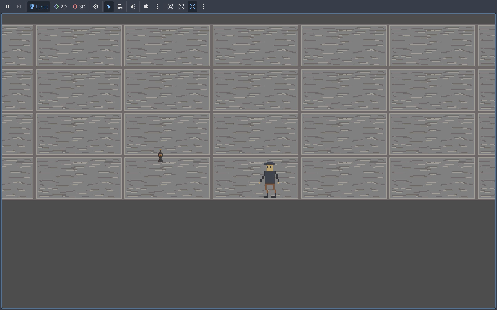

<h1 align="center"> Last Bottle </h1>
<h3 align="center"> Overview </h3>

Last Bottle is a 2D side-scrolling psychological action game developed as part of an academic game project. The game explores themes of heartbreak, insecurity, and self-destruction through a surreal hallucination loop experienced by the protagonist after a breakup and heavy drinking.

After losing his girlfriend of five years, the protagonist drinks alone in his bedroom until he blacks out. He awakens inside a distorted mental space where fragments of his own insecurities manifest as hostile entities. Trapped inside this hallucination, the player must survive by confronting and fighting these manifestations using improvised weapons — primarily by throwing bottles.

The core experience focuses on internal conflict rather than external enemies. Each encounter represents a psychological struggle: losing inside the hallucination implies losing in reality, while surviving offers the possibility of waking up and starting over. The contrast between mundane environments and surreal threats is central to the game’s identity.

## screenshot

## youtube
https://youtu.be/zCz2Tq7l8P0

## Asset
Character: https://ipixl.itch.io/pixel-art-animated-character
Bottle: https://ipixl.itch.io/pixel-art-items-part-1
Repeatable wall: https://shahwrong.itch.io/pixel-art-stone-floorwall
Furnitures: https://ipixl.itch.io/pixel-art-ussr-room-objects

## AI Usage
Gemini
1. The Core Movement & Combat System
The Prompt: "Create a Godot 4 script for a character with walk, run, and jump. Add a weapon switching system (R key) between throwing bottles (projectile) and a melee attack (J key)."

The AI Usage: The AI generated a state-machine-lite script that handled velocity and move_and_slide() while managing enum WeaponMode. It also provided the logic to "flip" the character and the attack points based on the direction the player is facing.

2. The Animated Sprite & Frame Slicing
The Prompt: "For the sprite frame is there anyway to crop it to be smaller? The orange box is too big and there is empty air around the character."

The AI Usage: The AI explained how to use the SpriteFrames Editor in Godot to re-slice the grid. It guided the manual adjustment of the Offset and Region settings to ensure the collision boxes perfectly matched the pixel art, preventing "floaty" movement.

3. The Cinematic Camera
The Prompt: "I see the void below my floor. I want the camera to zoom in on the player and focus more on the upper floor and walls."

The AI Usage: The AI provided the exact values for Camera2D Zoom (set to 2.0 for pixel art) and used a negative Y-Offset to shift the view upward. It also implemented Position Smoothing to give the game a modern, polished feel.

4. The Kill-Based Wave Manager
The Prompt: "I want 5 waves. Wave 1 has 1 enemy, Wave 5 has 10. Each wave must die before the next one starts. Wave 5 should be called 'Final Battle' and the text should be white."

The AI Usage: This was a complex transition from time-based spawning to Signal-based logic. The AI wrote a WaveManager that connects to the tree_exited signal of enemies. It used a match statement to scale the difficulty and automated the transition between waves with await timers for a "breather" period.

5. Advanced UI & Start Screen
The Prompt: "I want to press ENTER to start. I need a text flashing 'Press Enter' and instructions like J to attack and R to switch modes."

The AI Usage: The AI utilized BBCode to create a dynamic UI. It used [pulse] for the flashing effect and [font_size] to ensure the text was readable on a high-resolution MacBook screen. It also debugged "clipping" issues by guiding the adjustment of Custom Minimum Size and Anchors.

6. Failure & Victory States
The Prompt: "When I die, show 'Game Over' for 5 seconds then restart. Make 'You Win' a lot bigger and green."
